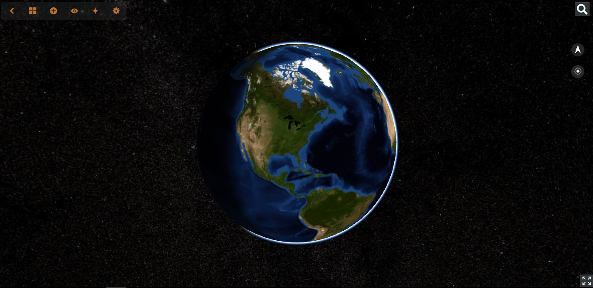
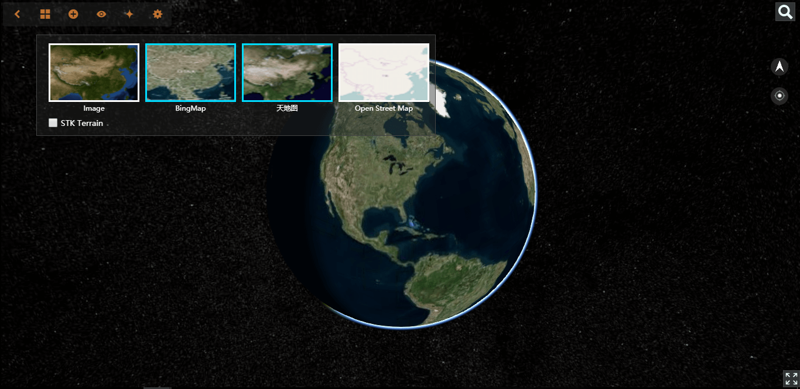
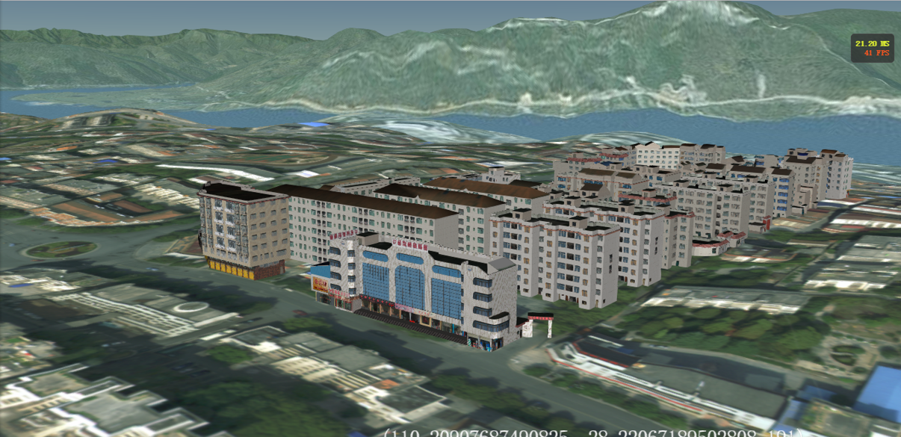
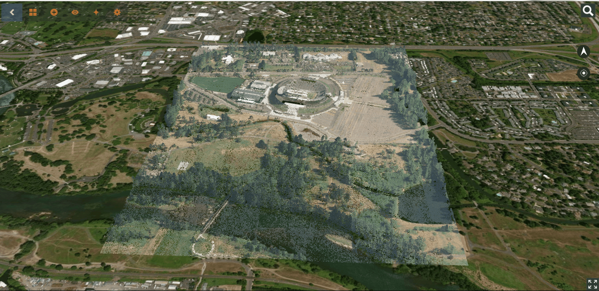
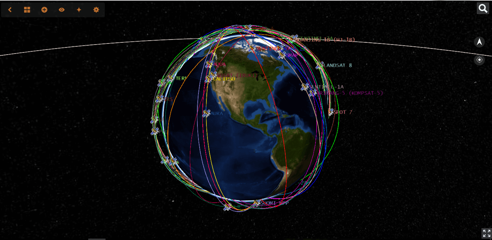
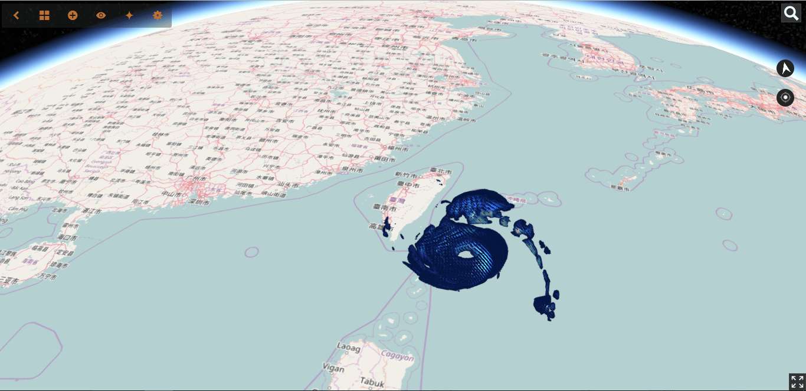
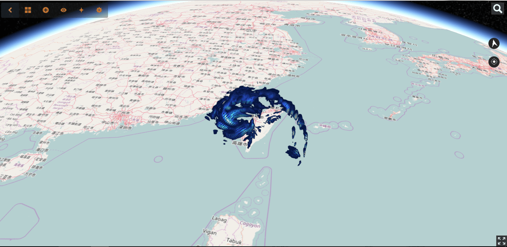
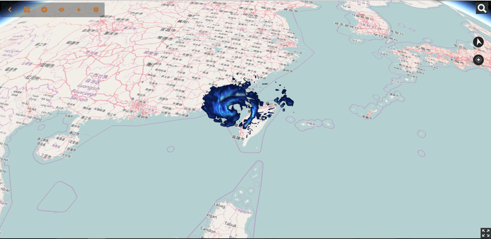
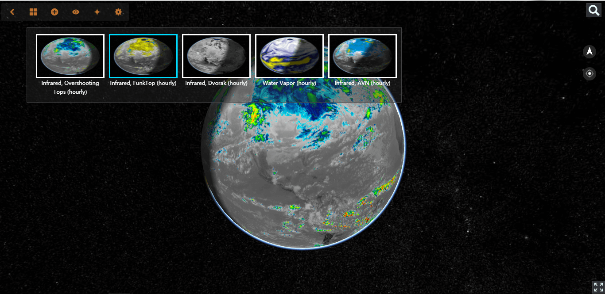

# 3d-earth-visualization

基于[cesium](https://github.com/AnalyticalGraphicsInc/cesium)，搭建了一个三维虚拟地球，主要进行三维可视化，数据可视化和城市场景展示。

## 系统整体界面

## 地图服务

可以接入Bing Maps服务，天地图服务，Open Street Map服务，以及Blue Marble 服务。其中Blue Marble是自己利用NASA网站的全球地图影像，进行地图切片，并发布成TMS服务。

## 城市场景展示

### 纽约市大规模城市群

### 芦溪镇

### 点云数据

## 数据可视化

### 卫星轨迹可视化

### 人口数量分布可视化

### 台风（尼伯特）可视化

t1 时刻

t2 时刻

t3 时刻

t4 时刻

t5 时刻

## 分析

由[SSEC](http://www.ssec.wisc.edu/)数据中心生产的，全球红外线复合产品的增强视图。采用不同波段提取信息，用于自然灾害预测。

## 设置

设置大气渲染，光照渲染，雾化效果。